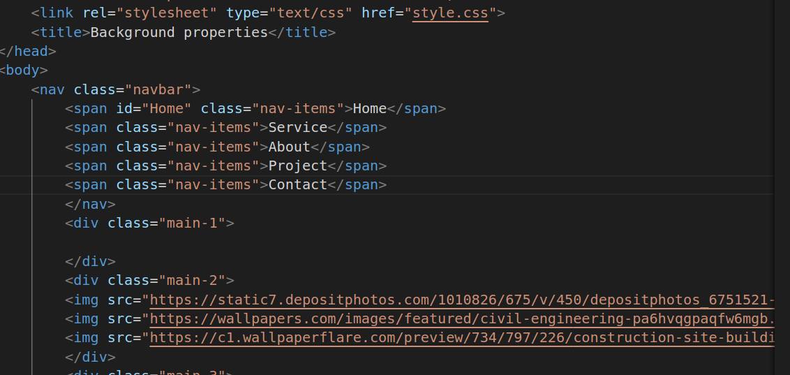
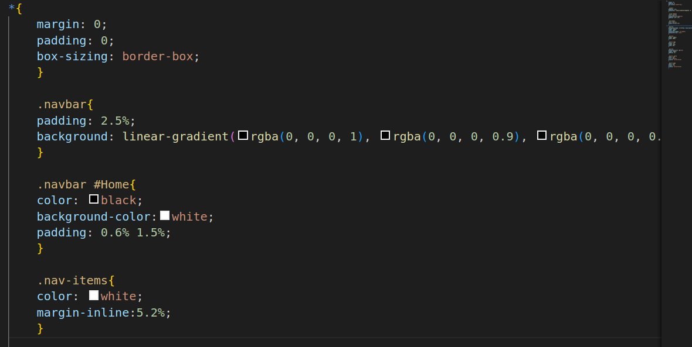
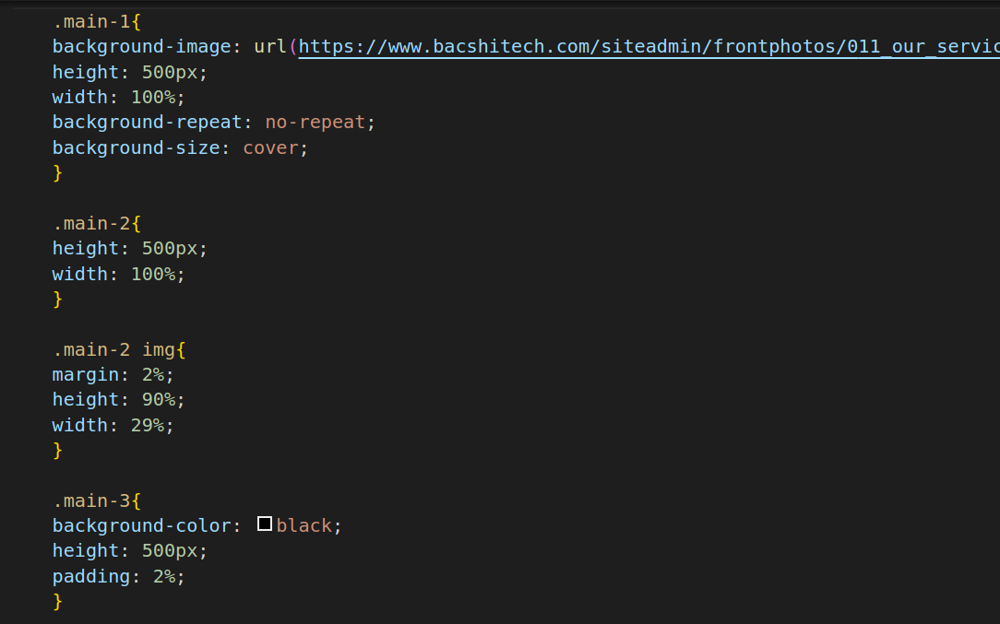
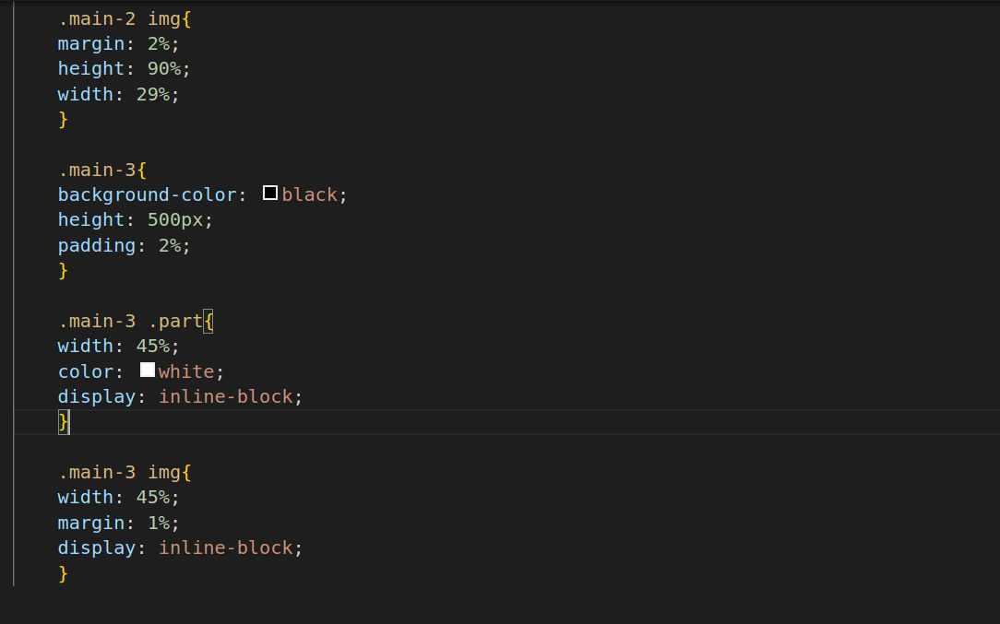

# Background properties

1.
* The link element is used to link an external CSS stylesheet named "style.css" to  HTML document.
* The nav element represents a navigation menu, often found at the top of a webpage.
* The span elements inside the navigation represent navigation items, such as "Home," "Service," "About," "Project," and "Contact."
* The div element represents a section or container in html page's content.
* The img elements are used to display images on the webpage. The src attribute specifies the image's URL, and the alt attribute provides alternative text for accessibility purposes.
* p is used to display paragraph text.

2.
* (Universal Selector):
This selector targets all HTML elements on the page.
The properties inside this block are used to reset default styling to ensure consistent styling across different browsers.
* margin: 0; padding: 0:These properties set the margin and padding of all elements to zero.
It helps in removing any default spacing that browsers might add to elements.
* box-sizing: border-box:This property changes the box model for all elements to "border-box."
It ensures that an element's padding and border are included in its total width and height, rather than being added to it.
* .navbar (Class Selector for Navigation Bar):This rule defines styles for a navigation bar.
padding adds space inside the .navbar element.background sets a linear gradient background with multiple color stops, creating a fading effect from black to transparent.
* .navbar #Home (ID Selector for the Home Link):This rule specifically targets an element with the ID "Home" inside the .navbar.color sets the text color to black.
* background-color sets the background color to white.
* padding adds space inside the element.

3.
* main-1 (Class Selector for the First Main Section):This rule defines styles for the first main section of the page.
* background-image sets a background image.
* height and width define the dimensions of the element.
* background-repeat specifies that the background image should not repeat.
* background-size sets the background image to cover the entire element.
* .main-2 (Class Selector for the Second Main Section):This rule defines styles for the second main section of the page.
* height and width define the dimensions of the element.
* .main-2 img (Nested Rule for Images in Main-2):This rule defines styles for images within the .main-2 section.
* margin adds space around the images.
* height and width specify the dimensions of the images.
* main-3 (Class Selector for the Third Main Section):This rule defines styles for the third main section of the page.
background-color sets the background color to black.
* height and padding define the dimensions and padding of the element.

4.
* main-3 .part (Nested Rule for Parts in Main-3):This rule defines styles for elements with the class .part inside the .main-3 section.
* width sets the width of these elements.color sets the text color to white.
* display: inline-block makes these elements display inline but with block-level properties.
* .main-3 img (Nested Rule for Images in Main-3):This rule defines styles for images within the .main-3 section.
* width sets the width of the images.
* margin adds space around the images.
* display: inline-block makes these images display inline but with block-level properties.
